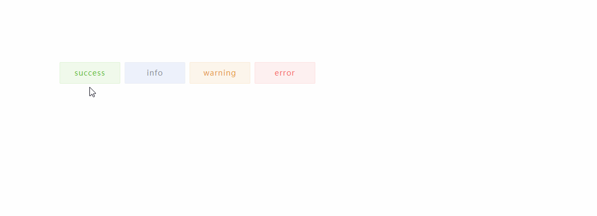

# vue-msgs

## Introduction
 This is a vue component of message, you can show message by call the method of showMsg, and it will hidden when timeout.

## Demo


## Install
``` 
$   npm install vue-msgs --save
```

## Usage
```
# import
import VueMsg from 'vue-msgs'
Vue.use(VueMsg)

# use in component
<vue-msg ref="vueMsg"></vue-msg>

# show message
this.$refs.vueMsg.showMsg('success', 'this is a message')

# there is a simply demo
npm install
npm run demo

```

## Methods
name | brief |  param   
-|-|-   
showMsg | open the message interface | type: the type of message, support 'success'/'info'/'warning'/'error', info: the content of message |   
  